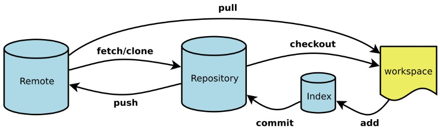

# git

<!--
create time: 2015-12-10 10:00:52
Author: <TODO: liutian>

This file is created by Marboo<http://marboo.io> template file $MARBOO_HOME/.media/starts/default.md
本文件由 Marboo<http://marboo.io> 模板文件 $MARBOO_HOME/.media/starts/default.md 创建
-->



```
    Workspace：工作区
    Index / Stage：暂存区
    Repository：仓库区（或本地仓库）
    Remote：远程仓库
```
###常用6大命令
1. add

 
   ```
        git add * //新增所有文件
        git add <filename> //新增单个文件
    ```
2. commit


    ```
    git commit -m "代码提交信息" 
    //保存到本地仓库，要写详细的代码提交信息，每次在工作区写完一个代码就及时commit
    ```
3. push
 

    ```
    git push origin master 
    //master是表示要提交的远程分支
    ```
4. fetch/clone
 

    ```
    git clone <address>
    //克隆一个远端仓库，address可以是http地址，也可以是ssh地址
    ```
5. checkout
 

    ```
    git checkout master 
    //回到master分支
    git checkout <commit> <file> 
    //查看文件之前的版本。它将工作目录中的<file>文件变成<commit>中那个文件的拷贝，并将它加入缓存区。
    git checkout <commit>
    //更新工作目录中的所有文件，使得和某个特定提交中的文件一致
    ```
6. pull
 

    ```
    git pull  //从远端分支拉取别人的提交
    ```